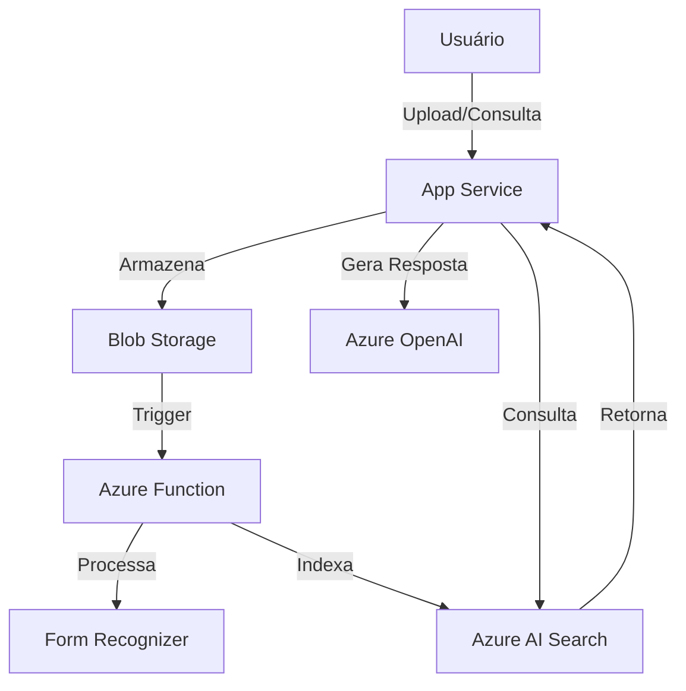

# 📚 PDF Chat - Assistente de Pesquisa Acadêmica  

**Um assistente inteligente baseado em IA que responde perguntas sobre seus artigos e documentos PDF**  

## 📊 Arquitetura  



## 🚀 Visão Geral  

O **PDF Chat** é uma solução inovadora para estudantes e pesquisadores que precisam extrair informações de diversos artigos científicos e documentos PDF. Com tecnologias de IA generativa e busca vetorial, o sistema permite:  

- 📤 **Upload** de múltiplos arquivos PDF  
- 🔍 **Indexação automática** do conteúdo  
- 💬 **Chat interativo** que responde com base nos documentos  
- 🧠 **Respostas contextualizadas** usando GPT-4  

## ⚙️ Tecnologias Utilizadas  

| Serviço Azure | Função |
|--------------|--------|
| **Azure Blob Storage** | Armazenamento dos PDFs |
| **Azure AI Search** | Busca vetorial e indexação |
| **Azure OpenAI** | Geração de embeddings e respostas |
| **Azure App Service** | Hospedagem da aplicação web |
| **Azure Functions** | Processamento em background |

## 📋 Pré-requisitos  

- Conta Azure com acesso aos serviços:  
  - Azure OpenAI Service  
  - Azure AI Search  
- Python 3.8+  
- Azure CLI instalado  
- Terraform (para deploy automatizado)  

## 🛠️ Instalação e Configuração  

1. **Clone o repositório**  
```bash
git clone https://github.com/seu-usuario/pdf-chat.git
cd pdf-chat
```

2. **Configure as credenciais Azure**  
```bash
az login
```

3. **Execute o script de deploy**  
```bash
chmod +x scripts/deploy.sh
./scripts/deploy.sh
```

## 🎯 Como Usar  

1. Acesse a URL do App Service após o deploy  
2. Faça upload dos seus PDFs acadêmicos  
3. Comece a interagir com o assistente:  
   - "Quais os principais métodos discutidos nesses artigos?"  
   - "Mostre as referências sobre machine learning"  
   - "Compare as abordagens dos autores sobre deep learning"  


## 📝 Roadmap  

- [x] Versão inicial com suporte a PDF  
- [ ] Autenticação de usuários  
- [ ] Suporte a DOCX e PPTX  
- [ ] Histórico de conversas  
- [ ] Exportação de referências bibliográficas  

## 🤝 Contribuição  

Contribuições são bem-vindas! Siga os passos:  

1. Faça um fork do projeto  
2. Crie sua branch (`git checkout -b feature/nova-feature`)  
3. Commit suas mudanças (`git commit -m 'Adiciona nova feature'`)  
4. Push para a branch (`git push origin feature/nova-feature`)  
5. Abra um Pull Request  

## 📄 Licença  

Este projeto está licenciado sob a licença MIT - veja o arquivo [LICENSE](LICENSE) para detalhes.  

## ✉️ Contato  

Para dúvidas ou sugestões:  
[seu-email@exemplo.com](mailto:seu-email@exemplo.com)  

---

Desenvolvido com ❤️ por [Kyska Harrington] - **Solução perfeita para sua pesquisa acadêmica!** 🎓🔍
