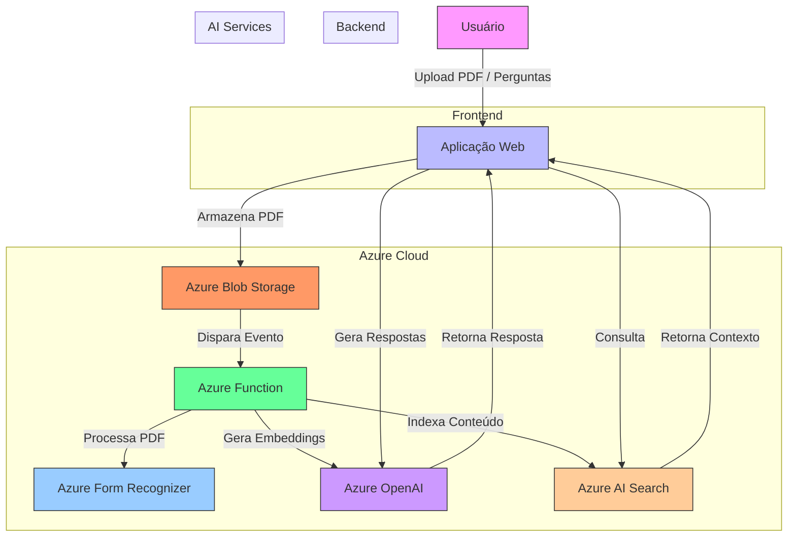

# Projeto de Chat Interativo com Azure AI para Análise de PDFs

Vou criar um projeto completo para implementar um sistema de chat que responde com base no conteúdo de arquivos PDF, utilizando os serviços da Azure. Este projeto incluirá a infraestrutura na nuvem, o código necessário e as instruções de implementação.

## Arquitetura da Solução



## Explicación de los componentes:

1. **Usuario**: Interactúa con la aplicación web
2. **Aplicación Web** (Azure App Service): 
   - Interfaz para upload de PDFs y chat
   - Coordina las operaciones

3. **Azure Blob Storage**:
   - Almacena los PDFs subidos
   - Dispara eventos cuando llegan nuevos archivos

4. **Azure Function**:
   - Procesamiento en background de los PDFs
   - Coordina el pipeline de extracción y indexación

5. **Azure Form Recognizer**:
   - Extrae texto estructurado de los PDFs

6. **Azure OpenAI**:
   - Genera embeddings del contenido
   - Produce respuestas usando GPT-4

7. **Azure AI Search**:
   - Almacena los embeddings y contenido indexado
   - Realiza búsquedas vectoriales semánticas


A solução utilizará os seguintes serviços da Azure:
- **Azure Blob Storage**: Para armazenar os PDFs
- **Azure AI Search**: Para indexação e busca vetorial
- **Azure OpenAI Service**: Para gerar embeddings e respostas
- **Azure App Service**: Para hospedar a aplicação web
- **Azure Functions**: Para processamento em background

## 1. Configuração Inicial

### Pré-requisitos
- Conta Azure com acesso aos serviços:
  - Azure OpenAI Service
  - Azure AI Search
  - Azure Storage
- Python 3.8+
- Azure CLI instalado

### arquivo `infra/terraform/main.tf`
```terraform
terraform {
  required_providers {
    azurerm = {
      source  = "hashicorp/azurerm"
      version = "~> 3.0"
    }
  }
}

provider "azurerm" {
  features {}
}

resource "azurerm_resource_group" "pdf_chat_rg" {
  name     = "pdf-chat-rg"
  location = "eastus"
}

resource "azurerm_storage_account" "pdf_storage" {
  name                     = "pdfchatstorage"
  resource_group_name      = azurerm_resource_group.pdf_chat_rg.name
  location                 = azurerm_resource_group.pdf_chat_rg.location
  account_tier             = "Standard"
  account_replication_type = "LRS"
}

resource "azurerm_search_service" "pdf_search" {
  name                = "pdf-chat-search"
  resource_group_name = azurerm_resource_group.pdf_chat_rg.name
  location            = azurerm_resource_group.pdf_chat_rg.location
  sku                 = "standard"
}

resource "azurerm_cognitive_account" "openai" {
  name                = "pdf-chat-openai"
  location            = azurerm_resource_group.pdf_chat_rg.location
  resource_group_name = azurerm_resource_group.pdf_chat_rg.name
  kind                = "OpenAI"
  sku_name            = "S0"
}
```

## 2. Backend - Processamento de PDFs

### arquivo `backend/process_pdf/__init__.py`
```python
import os
import logging
from azure.storage.blob import BlobServiceClient
from azure.search.documents import SearchClient
from azure.core.credentials import AzureKeyCredential
from azure.ai.formrecognizer import DocumentAnalysisClient
from azure.openai import OpenAI

# Configurações
AZURE_STORAGE_CONNECTION_STRING = os.getenv("AZURE_STORAGE_CONNECTION_STRING")
AZURE_SEARCH_ENDPOINT = os.getenv("AZURE_SEARCH_ENDPOINT")
AZURE_SEARCH_KEY = os.getenv("AZURE_SEARCH_KEY")
AZURE_OPENAI_ENDPOINT = os.getenv("AZURE_OPENAI_ENDPOINT")
AZURE_OPENAI_KEY = os.getenv("AZURE_OPENAI_KEY")

def process_pdf(blob_name: str):
    try:
        # Download do PDF do Blob Storage
        blob_service_client = BlobServiceClient.from_connection_string(AZURE_STORAGE_CONNECTION_STRING)
        blob_client = blob_service_client.get_blob_client(container="pdfs", blob=blob_name)
        
        with open(f"/tmp/{blob_name}", "wb") as download_file:
            download_file.write(blob_client.download_blob().readall())
        
        # Extrair texto do PDF
        form_recognizer_client = DocumentAnalysisClient(
            endpoint=AZURE_OPENAI_ENDPOINT,
            credential=AzureKeyCredential(AZURE_OPENAI_KEY)
        )
        
        with open(f"/tmp/{blob_name}", "rb") as f:
            poller = form_recognizer_client.begin_analyze_document(
                "prebuilt-layout", document=f)
        
        result = poller.result()
        full_text = "\n".join([page.content for page in result.pages])
        
        # Criar embeddings e indexar no Azure AI Search
        openai_client = OpenAI(
            api_key=AZURE_OPENAI_KEY,
            base_url=f"{AZURE_OPENAI_ENDPOINT}/openai/deployments/text-embedding-ada-002"
        )
        
        response = openai_client.embeddings.create(
            input=full_text,
            model="text-embedding-ada-002"
        )
        
        embeddings = response.data[0].embedding
        
        # Indexar no Azure AI Search
        search_client = SearchClient(
            endpoint=AZURE_SEARCH_ENDPOINT,
            index_name="pdf-content",
            credential=AzureKeyCredential(AZURE_SEARCH_KEY)
        
        document = {
            "id": blob_name,
            "content": full_text,
            "embedding": embeddings,
            "metadata_storage_name": blob_name
        }
        
        search_client.upload_documents(documents=[document])
        
        logging.info(f"Processed and indexed {blob_name}")
        
    except Exception as e:
        logging.error(f"Error processing {blob_name}: {str(e)}")
        raise
```

### arquivo `backend/process_pdf/function.json`
```json
{
  "scriptFile": "__init__.py",
  "bindings": [
    {
      "name": "myblob",
      "type": "blobTrigger",
      "direction": "in",
      "path": "pdfs/{name}",
      "connection": "AZURE_STORAGE_CONNECTION_STRING"
    }
  ]
}
```

## 3. Frontend - Aplicação Web

### arquivo `frontend/app.py`
```python
from flask import Flask, render_template, request, jsonify
from azure.storage.blob import BlobServiceClient
from azure.search.documents import SearchClient
from azure.core.credentials import AzureKeyCredential
from azure.openai import OpenAI
import os

app = Flask(__name__)

# Configurações
app.config['UPLOAD_FOLDER'] = 'uploads'
AZURE_STORAGE_CONNECTION_STRING = os.getenv("AZURE_STORAGE_CONNECTION_STRING")
AZURE_SEARCH_ENDPOINT = os.getenv("AZURE_SEARCH_ENDPOINT")
AZURE_SEARCH_KEY = os.getenv("AZURE_SEARCH_KEY")
AZURE_OPENAI_ENDPOINT = os.getenv("AZURE_OPENAI_ENDPOINT")
AZURE_OPENAI_KEY = os.getenv("AZURE_OPENAI_KEY")

@app.route('/')
def home():
    return render_template('index.html')

@app.route('/upload', methods=['POST'])
def upload_file():
    if 'file' not in request.files:
        return jsonify({"error": "No file part"}), 400
    
    file = request.files['file']
    if file.filename == '':
        return jsonify({"error": "No selected file"}), 400
    
    if file and file.filename.endswith('.pdf'):
        blob_service_client = BlobServiceClient.from_connection_string(AZURE_STORAGE_CONNECTION_STRING)
        blob_client = blob_service_client.get_blob_client(container="pdfs", blob=file.filename)
        blob_client.upload_blob(file)
        return jsonify({"message": "File uploaded successfully"}), 200
    
    return jsonify({"error": "Invalid file type"}), 400

@app.route('/ask', methods=['POST'])
def ask_question():
    data = request.get_json()
    question = data.get('question')
    
    if not question:
        return jsonify({"error": "No question provided"}), 400
    
    # 1. Obter embedding da pergunta
    openai_client = OpenAI(
        api_key=AZURE_OPENAI_KEY,
        base_url=f"{AZURE_OPENAI_ENDPOINT}/openai/deployments/text-embedding-ada-002"
    )
    
    embedding = openai_client.embeddings.create(
        input=question,
        model="text-embedding-ada-002"
    ).data[0].embedding
    
    # 2. Buscar conteúdo relevante
    search_client = SearchClient(
        endpoint=AZURE_SEARCH_ENDPOINT,
        index_name="pdf-content",
        credential=AzureKeyCredential(AZURE_SEARCH_KEY))
    
    results = search_client.search(
        search_text=question,
        vector=embedding,
        top_k=3,
        vector_fields="embedding"
    )
    
    context = "\n\n".join([result['content'] for result in results])
    
    # 3. Gerar resposta com GPT
    completion_client = OpenAI(
        api_key=AZURE_OPENAI_KEY,
        base_url=f"{AZURE_OPENAI_ENDPOINT}/openai/deployments/gpt-4"
    )
    
    response = completion_client.chat.completions.create(
        model="gpt-4",
        messages=[
            {"role": "system", "content": "You are a helpful assistant that answers questions based on the provided context."},
            {"role": "user", "content": f"Context:\n{context}\n\nQuestion: {question}\nAnswer:"}
        ]
    )
    
    return jsonify({
        "answer": response.choices[0].message.content,
        "sources": [result['metadata_storage_name'] for result in results]
    })

if __name__ == '__main__':
    app.run(debug=True)
```

### arquivo `frontend/templates/index.html`
```html
<!DOCTYPE html>
<html lang="en">
<head>
    <meta charset="UTF-8">
    <meta name="viewport" content="width=device-width, initial-scale=1.0">
    <title>PDF Chat - TCC Assistant</title>
    <link href="https://cdn.jsdelivr.net/npm/bootstrap@5.3.0/dist/css/bootstrap.min.css" rel="stylesheet">
    <style>
        .chat-container {
            height: 70vh;
            overflow-y: auto;
        }
        .message {
            margin-bottom: 10px;
            padding: 10px;
            border-radius: 10px;
        }
        .user-message {
            background-color: #e3f2fd;
            margin-left: 20%;
        }
        .bot-message {
            background-color: #f5f5f5;
            margin-right: 20%;
        }
    </style>
</head>
<body>
    <div class="container mt-4">
        <h1 class="text-center">TCC Research Assistant</h1>
        <div class="row mt-4">
            <div class="col-md-8 offset-md-2">
                <div class="card">
                    <div class="card-header">
                        <h5>Upload PDFs</h5>
                    </div>
                    <div class="card-body">
                        <form id="uploadForm">
                            <div class="mb-3">
                                <input class="form-control" type="file" id="pdfFile" accept=".pdf" required>
                            </div>
                            <button type="submit" class="btn btn-primary">Upload</button>
                        </form>
                    </div>
                </div>
                
                <div class="card mt-4">
                    <div class="card-header">
                        <h5>Chat</h5>
                    </div>
                    <div class="card-body">
                        <div id="chatContainer" class="chat-container mb-3"></div>
                        <form id="chatForm">
                            <div class="input-group">
                                <input type="text" id="userInput" class="form-control" placeholder="Ask a question about your research...">
                                <button class="btn btn-primary" type="submit">Send</button>
                            </div>
                        </form>
                    </div>
                </div>
            </div>
        </div>
    </div>

    <script src="https://cdn.jsdelivr.net/npm/bootstrap@5.3.0/dist/js/bootstrap.bundle.min.js"></script>
    <script>
        document.getElementById('uploadForm').addEventListener('submit', async function(e) {
            e.preventDefault();
            const fileInput = document.getElementById('pdfFile');
            const formData = new FormData();
            formData.append('file', fileInput.files[0]);
            
            try {
                const response = await fetch('/upload', {
                    method: 'POST',
                    body: formData
                });
                
                const result = await response.json();
                if (response.ok) {
                    alert('PDF uploaded successfully!');
                    fileInput.value = '';
                } else {
                    alert(`Error: ${result.error}`);
                }
            } catch (error) {
                alert('Error uploading file');
                console.error(error);
            }
        });
        
        document.getElementById('chatForm').addEventListener('submit', async function(e) {
            e.preventDefault();
            const userInput = document.getElementById('userInput');
            const question = userInput.value.trim();
            
            if (!question) return;
            
            // Add user message to chat
            addMessageToChat(question, 'user');
            userInput.value = '';
            
            try {
                const response = await fetch('/ask', {
                    method: 'POST',
                    headers: {
                        'Content-Type': 'application/json',
                    },
                    body: JSON.stringify({ question })
                });
                
                const result = await response.json();
                if (response.ok) {
                    addMessageToChat(result.answer, 'bot');
                    // Show sources if available
                    if (result.sources && result.sources.length > 0) {
                        addMessageToChat(`Sources: ${result.sources.join(', ')}`, 'bot-sources');
                    }
                } else {
                    addMessageToChat(`Error: ${result.error}`, 'bot');
                }
            } catch (error) {
                addMessageToChat('Sorry, there was an error processing your question.', 'bot');
                console.error(error);
            }
        });
        
        function addMessageToChat(message, sender) {
            const chatContainer = document.getElementById('chatContainer');
            const messageDiv = document.createElement('div');
            messageDiv.classList.add('message');
            
            if (sender === 'user') {
                messageDiv.classList.add('user-message');
                messageDiv.innerHTML = `<strong>You:</strong><p>${message}</p>`;
            } else {
                messageDiv.classList.add('bot-message');
                if (sender === 'bot-sources') {
                    messageDiv.innerHTML = `<strong>Sources:</strong><p class="mb-0"><small>${message}</small></p>`;
                } else {
                    messageDiv.innerHTML = `<strong>Assistant:</strong><p>${message}</p>`;
                }
            }
            
            chatContainer.appendChild(messageDiv);
            chatContainer.scrollTop = chatContainer.scrollHeight;
        }
    </script>
</body>
</html>
```

## 4. Configuração do Azure AI Search

### arquivo `scripts/create_search_index.py`
```python
from azure.search.documents.indexes import SearchIndexClient
from azure.search.documents.indexes.models import (
    SearchIndex,
    SimpleField,
    SearchFieldDataType,
    SearchableField,
    VectorSearch,
    VectorSearchProfile,
    HnswAlgorithmConfiguration,
    SearchField
)
from azure.core.credentials import AzureKeyCredential
import os

AZURE_SEARCH_ENDPOINT = os.getenv("AZURE_SEARCH_ENDPOINT")
AZURE_SEARCH_KEY = os.getenv("AZURE_SEARCH_KEY")

def create_index():
    credential = AzureKeyCredential(AZURE_SEARCH_KEY)
    index_client = SearchIndexClient(endpoint=AZURE_SEARCH_ENDPOINT, credential=credential)
    
    fields = [
        SimpleField(name="id", type=SearchFieldDataType.String, key=True),
        SearchableField(name="content", type=SearchFieldDataType.String, analyzer_name="pt.microsoft"),
        SimpleField(name="metadata_storage_name", type=SearchFieldDataType.String, filterable=True),
        SearchField(
            name="embedding",
            type=SearchFieldDataType.Collection(SearchFieldDataType.Single),
            searchable=True,
            vector_search_dimensions=1536,
            vector_search_profile_name="my-vector-profile"
        )
    ]
    
    vector_search = VectorSearch(
        profiles=[VectorSearchProfile(name="my-vector-profile", algorithm_configuration_name="my-algorithms-config")],
        algorithms=[HnswAlgorithmConfiguration(name="my-algorithms-config")]
    )
    
    index = SearchIndex(
        name="pdf-content",
        fields=fields,
        vector_search=vector_search
    )
    
    try:
        index_client.create_index(index)
        print("Index created successfully")
    except Exception as e:
        print(f"Error creating index: {e}")
        raise

if __name__ == "__main__":
    create_index()
```

## 5. Deployment com Azure CLI

### arquivo `scripts/deploy.sh`
```bash
#!/bin/bash

# Configurar variáveis
RESOURCE_GROUP="pdf-chat-rg"
LOCATION="eastus"
STORAGE_ACCOUNT="pdfchatstorage"
FUNCTION_APP="pdf-chat-function"
APP_SERVICE="pdf-chat-app"
SEARCH_SERVICE="pdf-chat-search"
OPENAI_SERVICE="pdf-chat-openai"

# Criar grupo de recursos
az group create --name $RESOURCE_GROUP --location $LOCATION

# Implantar infraestrutura com Terraform
cd infra/terraform
terraform init
terraform apply -auto-approve
cd ../..

# Criar Azure Function
az functionapp create \
  --resource-group $RESOURCE_GROUP \
  --consumption-plan-location $LOCATION \
  --runtime python \
  --functions-version 4 \
  --name $FUNCTION_APP \
  --storage-account $STORAGE_ACCOUNT \
  --os-type linux

# Configurar variáveis de ambiente para a Function
az functionapp config appsettings set \
  --name $FUNCTION_APP \
  --resource-group $RESOURCE_GROUP \
  --settings \
    AZURE_STORAGE_CONNECTION_STRING=$(az storage account show-connection-string --name $STORAGE_ACCOUNT --resource-group $RESOURCE_GROUP --query "connectionString" -o tsv) \
    AZURE_SEARCH_ENDPOINT=$(az search service show --name $SEARCH_SERVICE --resource-group $RESOURCE_GROUP --query "hostName" -o tsv) \
    AZURE_SEARCH_KEY=$(az search admin-key show --resource-group $RESOURCE_GROUP --service-name $SEARCH_SERVICE --query "primaryKey" -o tsv) \
    AZURE_OPENAI_ENDPOINT=$(az cognitiveservices account show --name $OPENAI_SERVICE --resource-group $RESOURCE_GROUP --query "properties.endpoint" -o tsv) \
    AZURE_OPENAI_KEY=$(az cognitiveservices account keys list --name $OPENAI_SERVICE --resource-group $RESOURCE_GROUP --query "key1" -o tsv)

# Implantar Function
cd backend/process_pdf
func azure functionapp publish $FUNCTION_APP
cd ../..

# Criar App Service
az webapp up \
  --name $APP_SERVICE \
  --resource-group $RESOURCE_GROUP \
  --location $LOCATION \
  --sku B1 \
  --runtime "PYTHON:3.9"

# Configurar variáveis de ambiente para o App Service
az webapp config appsettings set \
  --name $APP_SERVICE \
  --resource-group $RESOURCE_GROUP \
  --settings \
    AZURE_STORAGE_CONNECTION_STRING=$(az storage account show-connection-string --name $STORAGE_ACCOUNT --resource-group $RESOURCE_GROUP --query "connectionString" -o tsv) \
    AZURE_SEARCH_ENDPOINT=$(az search service show --name $SEARCH_SERVICE --resource-group $RESOURCE_GROUP --query "hostName" -o tsv) \
    AZURE_SEARCH_KEY=$(az search admin-key show --resource-group $RESOURCE_GROUP --service-name $SEARCH_SERVICE --query "primaryKey" -o tsv) \
    AZURE_OPENAI_ENDPOINT=$(az cognitiveservices account show --name $OPENAI_SERVICE --resource-group $RESOURCE_GROUP --query "properties.endpoint" -o tsv) \
    AZURE_OPENAI_KEY=$(az cognitiveservices account keys list --name $OPENAI_SERVICE --resource-group $RESOURCE_GROUP --query "key1" -o tsv) \
    FLASK_ENV="production"

echo "Deployment completed successfully!"
```

## 6. Documentação e Instruções

### arquivo `README.md`
```markdown
# PDF Chat - TCC Research Assistant

Este projeto implementa um sistema de chat interativo que responde perguntas com base no conteúdo de arquivos PDF carregados, utilizando serviços da Azure como Azure AI Search, Azure OpenAI e Azure Storage.

## Funcionalidades

- Upload de arquivos PDF para análise
- Indexação automática do conteúdo dos PDFs
- Busca vetorial para encontrar conteúdo relevante
- Geração de respostas contextualizadas com GPT-4
- Interface web interativa para conversação

## Pré-requisitos

- Conta Azure com acesso aos serviços necessários
- Azure CLI instalado
- Python 3.8+
- Terraform (para implantação de infraestrutura)

## Como implantar

1. Clone este repositório
2. Configure as credenciais da Azure:
   ```bash
   az login
   ```
3. Execute o script de deploy:
   ```bash
   chmod +x scripts/deploy.sh
   ./scripts/deploy.sh
   ```

## Como usar

1. Acesse a URL do App Service após a implantação
2. Faça upload de PDFs relevantes para sua pesquisa
3. Comece a fazer perguntas sobre o conteúdo dos documentos

## Arquitetura


## Custos estimados

Os custos variam conforme o uso, mas aqui está uma estimativa mensal:
- Azure AI Search: ~$75 (Standard tier)
- Azure OpenAI Service: ~$50 (dependendo do volume de perguntas)
- Azure Storage: ~$5 (para armazenamento de PDFs)
- App Service: ~$15 (B1 tier)
- Azure Functions: ~$0 (plano Consumption)

## Melhorias futuras

- Adicionar suporte para mais formatos de documento (DOCX, PPTX)
- Implementar autenticação de usuários
- Adicionar histórico de conversas
- Melhorar a interface do usuário
```

## Considerações Finais

Este projeto completo implementa uma solução de chat baseada em documentos PDF utilizando os seguintes serviços da Azure:

1. **Azure Blob Storage**: Armazena os PDFs enviados pelos usuários
2. **Azure Functions**: Processa os PDFs em background quando são carregados
3. **Azure AI Search**: Indexa e realiza buscas vetoriais no conteúdo dos PDFs
4. **Azure OpenAI Service**: Gera embeddings e respostas contextualizadas
5. **Azure App Service**: Hospeda a aplicação web frontend

Para implementar este projeto:

1. Execute o script `deploy.sh` para criar toda a infraestrutura
2. Acesse a URL do App Service gerado
3. Faça upload de PDFs e comece a interagir com o assistente

O sistema está pronto para ajudar estudantes e pesquisadores a extrair informações valiosas de seus documentos acadêmicos de forma eficiente.
